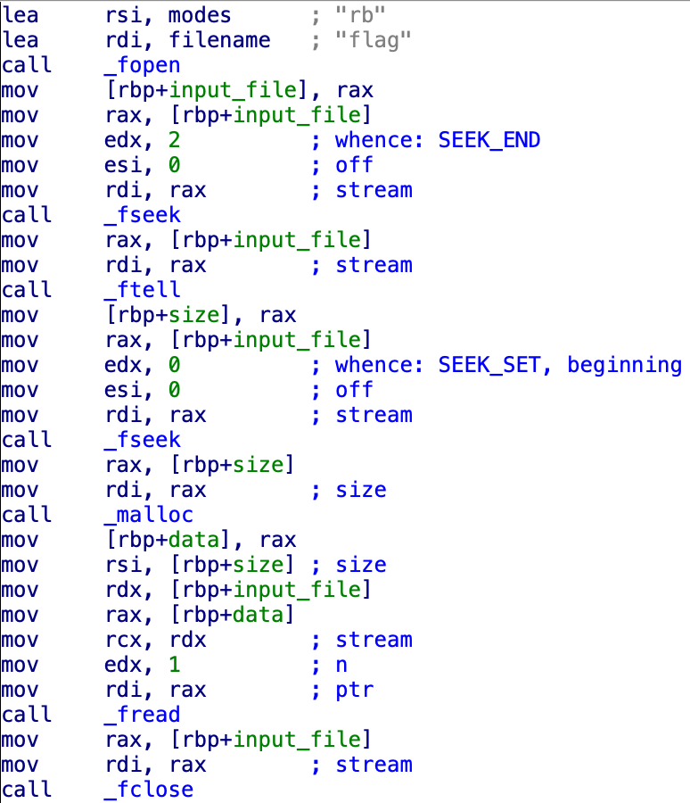
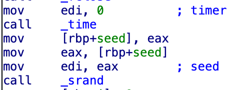
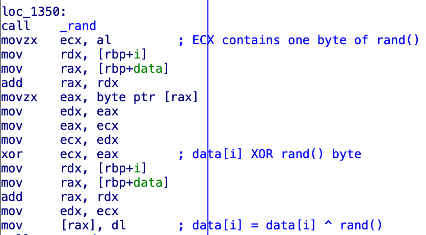
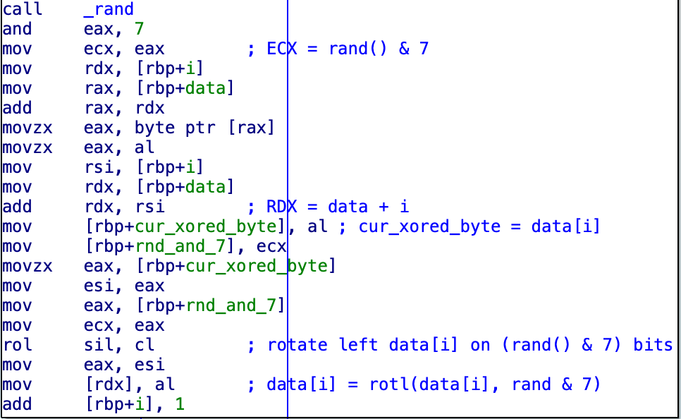
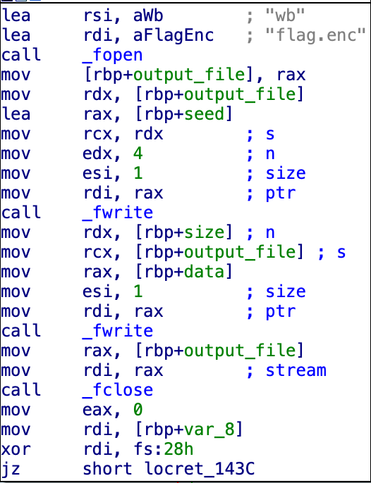

# Hack The Box [Simple Encryptor](https://app.hackthebox.com/challenges/Simple%2520Encryptor) challenge solution

## Challenge description

On our regular checkups of our secret flag storage server we found out that we were hit by ransomware!
The original flag data is nowhere to be found, but luckily we not only have the encrypted file but also
the encryption program itself.

## Encryption binary algorithm

### Initialization

First, program just reads all the bytes from the file to the `data` array:



Then it seeds standard C `rand()` algorithm with the result of `time()`:



### Encryption algorithm

Program iterates over the input `data` and performs the following actions on each `data` byte (`data[i]`):

`data[i]` is XORed with the result of `rand()` call, the result is saved to `data[i]`:



[Left circular shift](https://en.wikipedia.org/wiki/Circular_shift) is performed on `data[i]`: it is
rotated on `(rand() & 7)` bits:



The encryption cycle iteration can be described in C like this:
```C
data[i] ^= rand();
data[i] = rotl(data[i], rand() & 7);
```

### Saving results

Finally, seed value for `rand()` (which is value of `time()`) and encrypted bytes are saved to `flag.enc` 
file, seed is placed at the beginning of the file:



## Decryption notes

It is important to run decryption algorithm on `Linux`, because encryption was performed on `Linux` too, and `rand()` may produce different values on other systems 
(such as `macOS`) even with correct seed.
